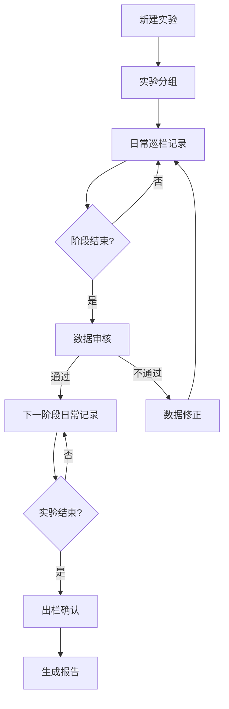
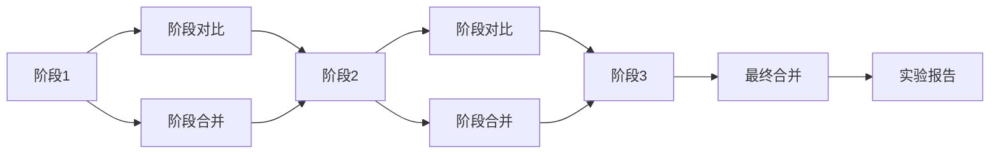
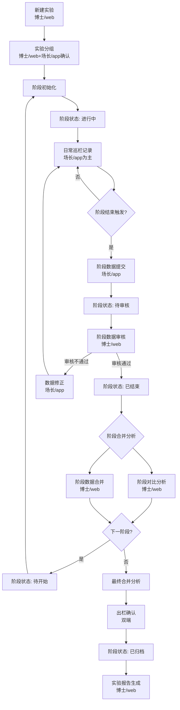
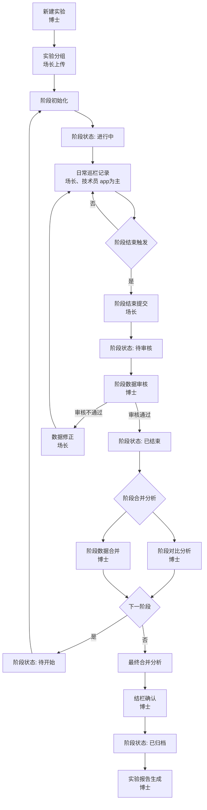

# 猪实验管理系统设计

> **Workspace:** d:\Trae CN\html_editor

---

## User
猪实验管理系统由博士主导设计、场长在现场执行记录。当前依靠 Excel 手工流转，存在数据不统一、实时性差、分析靠手工、溯源难等问题。现在需要设计产品，实现在App(场长记录) + Web(博士管理,批量上传数据 导出数据) 双端联动，实现实验数据标准化采集、自动化分析与全流程管控

## Assistant
我来帮您分析这个猪实验管理系统的产品需求。首先确认需求：**通过 App（场长记录）+ Web（博士管理）双端联动，解决当前 Excel 手工流转导致的数据不统一、实时性差、分析靠手工、溯源难等问题，实现实验数据标准化采集、自动化分析与全流程管控**。

---

## 一、问题分解（5个核心痛点）

### 1. 数据采集不规范
- **用户**：场长（现场执行记录）
- **痛点**：Excel手工记录缺乏统一模板，字段填写随意，数据格式不规范，同一指标存在多种记录方式

### 2. 数据实时性差
- **用户**：博士（远程管理）
- **痛点**：Excel文件离线流转，博士无法及时获取最新实验数据，影响决策效率

### 3. 数据分析低效
- **用户**：博士（数据分析）
- **痛点**：依赖手工汇总Excel数据，分析耗时且易出错，无法快速生成报表和可视化图表

### 4. 数据溯源困难
- **用户**：博士、场长（问题排查）
- **痛点**：Excel版本混乱，修改记录难以追踪，出现问题时无法快速定位原因

### 5. 流程协同不畅
- **用户**：博士、场长（协作）
- **痛点**：任务分配、进度跟踪依赖线下沟通，缺乏统一的任务管理和状态同步机制

---

## 二、逻辑闭环（验证条件）

| 问题点 | 验证逻辑（If...Then...） |
|--------|--------------------------|
| 数据采集不规范 | **If** 系统提供标准化表单模板且强制必填字段，**Then** 数据格式统一 |
| 数据实时性差 | **If** 场长提交数据后博士可即时查看，**Then** 数据实时性达标 |
| 数据分析低效 | **If** 系统自动生成预设报表和可视化图表，**Then** 分析效率提升 |
| 数据溯源困难 | **If** 每条记录包含操作人、时间、修改历史，**Then** 可追溯 |
| 流程协同不畅 | **If** 任务状态实时同步且支持消息通知，**Then** 协同效率提升 |

---

## 三、方案构思（7个核心功能方向）

### 1. **标准化数据采集模块（App/Web）**
- 预设实验记录模板（如：猪只信息、饲料记录、健康状况、体重监测等）
- 字段类型限制（数字/选择/日期），强制校验必填项
- 支持拍照上传（如：实验场景、样本采集照片）

### 2. **实时数据同步机制**
- App端数据即时上传云端
- Web端实时刷新展示最新数据
- 支持数据变更推送通知

### 3. **自动化报表分析（Web端）**
- 预设常用报表模板（周/月度实验汇总、趋势分析）
- 可视化图表（折线图、柱状图、饼图）
- 支持自定义筛选条件生成报表

### 4. **全流程溯源系统**
- 记录操作日志（操作人、时间、内容变更）
- 数据版本对比功能
- 支持按时间/操作人/猪只ID等维度检索

### 5. **任务协同管理（Web端为主）**
- 博士创建实验任务并分配给场长
- 场长接收任务并更新执行状态
- 任务进度可视化追踪

### 6. **批量数据处理（Web端）**
- 支持Excel批量导入（模板校验）
- 数据导出功能（Excel/PDF）
- 数据导入异常提示与日志

### 7. **数据安全与权限控制**
- 角色权限区分（博士：管理/分析；场长：记录/查看）
- 数据加密存储
- 操作审计日志

---

## 四、优先级与边界

### 优先级评估

| 方案 | 影响 | 成本 | 优先级 |
|------|------|------|--------|
| 标准化数据采集模块 | **高**（解决核心痛点） | 中 | **P0** |
| 实时数据同步机制 | **高**（提升协作效率） | 中 | **P0** |
| 全流程溯源系统 | **中**（问题排查需求） | 中 | **P1** |
| 自动化报表分析 | **高**（博士核心需求） | 中 | **P1** |
| 任务协同管理 | **中**（流程优化） | 中 | **P2** |
| 批量数据处理 | **中**（过渡期需求） | 低 | **P2** |
| 数据安全与权限控制 | **高**（基础保障） | 低 | **P0** |

### 推荐实施顺序
1. **第一阶段（核心MVP）**：标准化数据采集 + 实时同步 + 权限控制
2. **第二阶段（分析能力）**：自动化报表分析 + 全流程溯源
3. **第三阶段（协同优化）**：任务协同管理 + 批量数据处理

### 边界范围

**纳入范围：**
- 实验数据标准化采集与存储
- 双端数据实时同步
- 基础报表与可视化分析
- 数据追溯与操作日志
- 角色权限管理

**暂不纳入（后期扩展）：**
- 高级统计分析算法（如AI预测模型）
- 第三方系统集成（如实验室设备对接）
- 移动端离线数据存储（初期依赖网络）
- 复杂审批工作流

---

## 推荐总结

建议优先实现 **标准化数据采集** 和 **实时同步机制**，这是解决当前Excel手工流转痛点的核心。在此基础上逐步完善分析能力和协同功能，确保产品从"能用"到"好用"的渐进式演进。如需进一步细化某个模块的功能设计，欢迎继续探讨！

## User
我已经梳理出了大致的流程，这个作为后续每个模块的大框架，你看有什么要优化的地方么

## Assistant
我仔细分析了您的流程框架，整体逻辑清晰，覆盖了从实验创建到出栏的完整流程。以下是针对流程优化的建议：

---

## 一、流程结构优化

### 1. **消除流程重复，明确阶段划分**
当前步骤3和步骤5都是"日常巡栏记录"，建议明确区分：
- **步骤3**：**阶段内日常记录**（如：第1-4周的日常巡栏）
- **步骤5**：**跨阶段过渡记录**（如：阶段结束后的衔接记录）

### 2. **增加"数据审核"环节**
建议在"阶段结束"（步骤4）和"出栏"（步骤6）之间增加**数据审核节点**：
```
步骤4: 阶段结束 → 步骤4.5: 数据审核（博士确认） → 步骤5: 日常巡栏记录 → 步骤6: 出栏
```

---

## 二、角色与权限优化

### 1. **明确双端操作边界**
| 步骤 | 建议入口 | 理由 |
|------|----------|------|
| 新建实验 | **web端（博士）** | 涉及实验设计和基础配置，适合大屏操作 |
| 实验分组 | **web端为主，app端辅助确认** | 博士配置，场长确认 |
| 日常巡栏记录 | **app端为主，web端补录** | 场长现场操作，app更便捷 |
| 阶段结束/出栏 | **双端均可** | 场长提交，博士审核 |

### 2. **增加权限分层**
- **博士**：创建/编辑实验、审核数据、生成报告、管理用户
- **场长**：查看分配任务、录入日常数据、提交阶段报告
- **管理员**：系统设置、数据备份、用户管理

---

## 三、数据流转优化

### 1. **强化数据校验机制**
| 步骤 | 校验规则 |
|------|----------|
| 新建实验 | 实验代码唯一性校验、必填字段完整性 |
| 实验分组 | 猪只编号唯一性、初始数据格式校验 |
| 日常巡栏 | 数据范围校验（如体重合理区间）、时间顺序校验 |
| 阶段结束 | 数据完整性检查（是否所有猪只都有记录） |

### 2. **增加数据追溯链路**
每条记录应包含：
- 操作人、操作时间
- 数据来源（手动录入/自动采集）
- 修改历史记录

---

## 四、异常处理优化

### 1. **异常情况处理流程**
```
异常发现（场长）→ 异常记录（app端填写原因）→ 异常审核（博士确认）→ 异常处理（调整实验方案/重新记录）
```

### 2. **数据冲突解决机制**
当多人同时编辑同一数据时：
- 采用"最后更新者获胜"原则
- 自动保存历史版本，支持回滚

---

## 五、反馈机制优化

### 1. **实时状态同步**
- 场长提交数据后，博士即时收到通知
- 博士审核通过后，场长收到确认反馈

### 2. **进度可视化**
- 实验进度条（已完成阶段/总阶段）
- 数据完整性仪表盘（已录入记录/应录入记录）

---

## 六、输出数据优化

### 1. **标准化报告模板**
预设报告类型：
- 阶段总结报告
- 实验对比分析报告
- 异常情况汇总报告

### 2. **数据导出格式**
支持多种格式导出：
- Excel（便于进一步分析）
- PDF（便于分享和存档）
- JSON（便于系统对接）

---

## 优化后流程示意



---

## 总结建议

1. **优先解决重复性问题**：合并或明确区分步骤3和步骤5
2. **加强数据校验**：在每个关键节点增加数据质量检查
3. **优化角色协同**：明确双端操作场景，提升协作效率
4. **增加异常处理**：建立完整的异常记录和处理流程

如需进一步细化某个环节，或讨论技术实现方案，欢迎继续沟通！

## User
为什么会有阶段合并，和阶段结束，最后才是实验结束。是一个实验里面拆分成几个阶段，阶段与阶段之间会做对比，也会做合并，以及最终实验结束，会有所有阶段的大合并和汇总

## Assistant
您的理解完全正确！阶段化设计是实验管理系统的核心逻辑，主要基于以下业务需求：

---

## 阶段化设计的核心价值

### 1. **实验周期管理需求**
大型养猪实验通常持续数月，需要分阶段管理：
- **生长周期划分**：断奶期 → 育肥期 → 出栏期
- **干预周期划分**：对照组观察期 → 试验处理期 → 效果评估期

### 2. **阶段对比分析**
| 对比维度 | 业务价值 |
|----------|----------|
| **同阶段内对比** | 评估同一阶段不同分组的差异（如：A组 vs B组在第2阶段的体重增长） |
| **跨阶段对比** | 观察同一分组在不同阶段的变化趋势（如：A组从第1阶段到第3阶段的饲料转化率变化） |

### 3. **阶段合并的意义**
```
阶段1数据 + 阶段2数据 + 阶段3数据 = 完整实验数据集
```
- **阶段性合并**：用于中期分析（如：前2阶段合并分析，决定是否调整实验方案）
- **最终合并**：实验结束时的完整数据分析和报告生成

---

## 流程设计合理性验证

### 当前流程的逻辑闭环


### 阶段结束 vs 实验结束
| 环节 | 触发条件 | 输出内容 |
|------|----------|----------|
| **阶段结束** | 达到预设时间节点或完成阶段目标 | 阶段报告、阶段对比分析、下一阶段任务 |
| **实验结束** | 所有阶段完成 | 完整实验报告、跨阶段对比分析、归档数据 |

---

## 潜在优化建议

### 1. **增加阶段状态管理**
```
待开始 → 进行中 → 待审核 → 已结束 → 已归档
```
- 场长提交阶段结束申请
- 博士审核阶段数据完整性
- 审核通过后进入下一阶段

### 2. **支持灵活的合并维度**
除了时间顺序合并，可增加：
- **按分组合并**：如：合并所有对照组数据
- **按指标合并**：如：合并所有体重相关数据

---

您的流程设计完全符合实验管理的业务逻辑，阶段划分和合并机制能够满足博士进行多维度分析的需求。如需进一步细化某个环节的操作流程或数据结构，欢迎继续探讨！

## User
嗯，你说的阶段状态管理很好，需要纳入后续对具体模块和整个产品的考虑中。请把流程设计图与前面的整个流程逻辑合并表达

## Assistant
我将阶段状态管理与原有流程逻辑合并，形成完整的流程设计图：

---

## 完整流程设计图



---

## 流程节点详解

### 1. **实验初始化层**
| 步骤 | 角色 | 入口 | 说明 |
|------|------|------|------|
| 新建实验 | 博士 | web | 创建实验代码、设计方案 |
| 实验分组 | 博士/场长 | web/app | 博士配置，场长确认 |

### 2. **阶段执行层（循环）**
| 步骤 | 角色 | 入口 | 状态变化 |
|------|------|------|----------|
| 阶段初始化 | 系统 | 自动 | 待开始 → 进行中 |
| 日常巡栏记录 | 场长 | app | 数据实时同步 |
| 阶段结束提交 | 场长 | app | 进行中 → 待审核 |
| 阶段审核 | 博士 | web | 待审核 → 已结束 |
| 数据修正 | 场长 | app | 待审核 → 进行中 |

### 3. **阶段分析层**
| 分析类型 | 触发时机 | 输出 |
|----------|----------|------|
| 阶段对比 | 每个阶段结束后 | 同阶段分组差异分析 |
| 阶段合并 | 多阶段完成后 | 跨阶段趋势分析 |
| 最终合并 | 实验结束时 | 完整实验数据集 |

### 4. **实验收尾层**
| 步骤 | 角色 | 入口 | 说明 |
|------|------|------|------|
| 出栏确认 | 场长/博士 | 双端 | 确认实验结束 |
| 报告生成 | 博士 | web | 导出完整报告 |

---

## 状态流转矩阵

| 当前状态 | 操作 | 下一状态 |
|----------|------|----------|
| 待开始 | 启动阶段 | 进行中 |
| 进行中 | 提交结束 | 待审核 |
| 待审核 | 审核通过 | 已结束 |
| 待审核 | 审核不通过 | 进行中 |
| 已结束 | 启动下一阶段 | 待开始 |
| 已结束 | 无下一阶段 | 已归档 |

---

## 核心优势

1. **状态可视化**：清晰展示每个阶段的生命周期状态
2. **审核机制**：确保数据质量，避免错误进入下一阶段
3. **灵活分析**：支持阶段内对比和跨阶段合并分析
4. **双端协同**：场长专注记录，博士专注分析，分工明确

如需进一步细化某个节点的功能设计或数据结构，欢迎继续探讨！

## User
流程图我需要编辑修改一下具体文字

## Assistant
好的，请告诉我您想修改流程图中的哪些具体文字？您可以说明：

1. **需要修改的节点名称**（如："日常巡栏记录" → "日常巡检记录"）
2. **需要调整的流程描述**（如：角色、入口、说明等）
3. **需要增加或删除的节点**

我会根据您的需求进行调整！

## User
你把每个节点的文字暹罗列出来

## Assistant
好的，以下是流程图中所有节点的文字内容，按流程顺序罗列：

---

### **实验初始化层**
1. 新建实验  
   博士/web  
2. 实验分组  
   博士/web+场长/app确认  
3. 阶段初始化  

### **阶段执行层**
4. 阶段状态: 进行中  
5. 日常巡栏记录  
   场长/app为主  
6. 阶段结束触发?  
7. 阶段数据提交  
   场长/app  
8. 阶段状态: 待审核  
9. 阶段数据审核  
   博士/web  
10. 审核通过  
11. 阶段状态: 已结束  
12. 审核不通过  
13. 数据修正  
    场长/app  

### **阶段分析层**
14. 阶段合并分析  
15. 阶段对比分析  
    博士/web  
16. 阶段数据合并  
    博士/web  
17. 下一阶段?  
18. 阶段状态: 待开始  

### **实验收尾层**
19. 最终合并分析  
20. 出栏确认  
    双端  
21. 阶段状态: 已归档  
22. 实验报告生成  
    博士/web  

---

请告诉我您想修改哪些节点的文字，我会为您更新流程图！

## User
请改成以下的表述： 
 ### 实验初始化层 
 1. 新建实验 
     博士 
 2. 实验分组 
    场长上传 
 3. 阶段初始化 
 ### 阶段执行层 
 4. 阶段状态: 进行中 
 5. 日常巡栏记录 
     场长、技术员 app为主 
 6. 阶段结束触发 
 7. 阶段结束提交 
     场长 
 9. 阶段数据审核 
     博士 
 10. 审核通过 
 11. 阶段状态: 已结束 
 12. 审核不通过 
 13. 数据修正 
      场长 
 ### 阶段分析层 
 14. 阶段合并分析 
 15. 阶段对比分析 
      博士 
 16. 阶段数据合并 
      博士 
 17. 下一阶段 
 18. 阶段状态: 待开始 
 ### 实验收尾层 
 19. 最终合并分析 
 20. 结栏确认 
      博士 
 21. 阶段状态: 已归档 
 22. 实验报告生成 
      博士

## Assistant
好的，我根据您提供的修改内容更新流程图：

---

## 完整流程设计图



---

## 流程节点详解

### 1. **实验初始化层**
| 步骤 | 角色 | 说明 |
|------|------|------|
| 新建实验 | 博士 | 创建实验代码、设计方案 |
| 实验分组 | 场长上传 | 场长上传分组信息 |

### 2. **阶段执行层（循环）**
| 步骤 | 角色 | 状态变化 |
|------|------|----------|
| 阶段初始化 | 系统 | 待开始 → 进行中 |
| 日常巡栏记录 | 场长、技术员 | 数据实时同步 |
| 阶段结束提交 | 场长 | 进行中 → 待审核 |
| 阶段审核 | 博士 | 待审核 → 已结束 |
| 数据修正 | 场长 | 待审核 → 进行中 |

### 3. **阶段分析层**
| 分析类型 | 触发时机 | 输出 |
|----------|----------|------|
| 阶段对比 | 每个阶段结束后 | 同阶段分组差异分析 |
| 阶段合并 | 多阶段完成后 | 跨阶段趋势分析 |
| 最终合并 | 实验结束时 | 完整实验数据集 |

### 4. **实验收尾层**
| 步骤 | 角色 | 说明 |
|------|------|------|
| 结栏确认 | 博士 | 确认实验结束 |
| 报告生成 | 博士 | 导出完整报告 |

---

## 状态流转矩阵

| 当前状态 | 操作 | 下一状态 |
|----------|------|----------|
| 待开始 | 启动阶段 | 进行中 |
| 进行中 | 提交结束 | 待审核 |
| 待审核 | 审核通过 | 已结束 |
| 待审核 | 审核不通过 | 进行中 |
| 已结束 | 启动下一阶段 | 待开始 |
| 已结束 | 无下一阶段 | 已归档 |

---

流程图已按您的要求更新完成！如需进一步调整，请随时告知。

